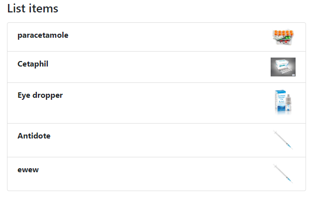
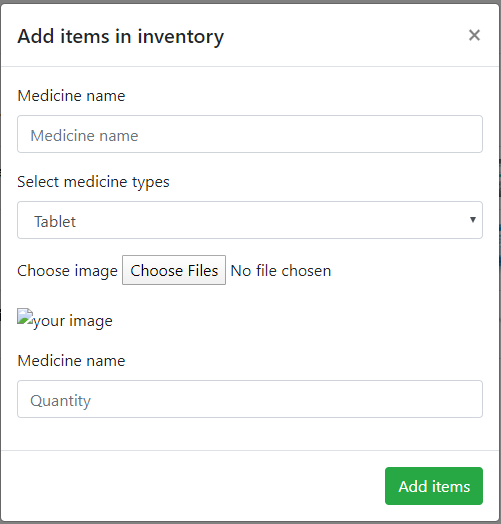
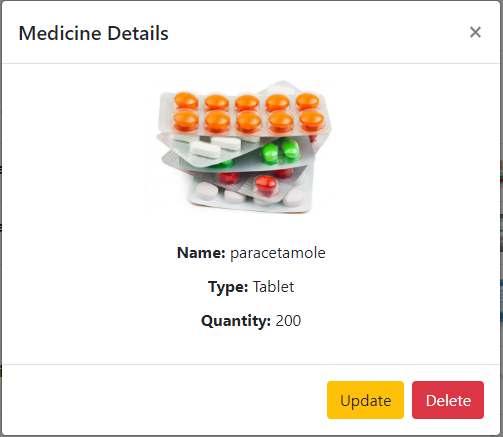
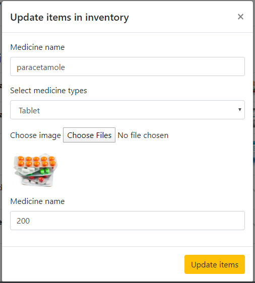

# Inventory management system 

This system is used for keeping the record of the medicine (Medicine name,type,image,quantity).
We have used four differnt js file here:

* app.js
* UIcontroller.js
* DataController.js
* LocalStorage.js

Flow of the program

> when you run index.html then initially you will observe the following event happening in your screen




The list Item will later on display the name list of the medicines.

>Then you click the add button you will see a pop up card that is the card where you can add and update the details of the medicine.

looks something like this:



>code:

```javascript


function addItemInInventory(e){
    const name =  document.getElementById('medicine-name').value;
    const medicinetype = document.getElementById('medicine-type').value;
    const image = document.getElementById('medicine-image').value;
    const image_base64 = document.getElementById('medicine-image-base64').src;
    const quantity = document.getElementById('medicine-quantity').value;
    const data = Store.getMedicine();

    let ID;
      //Create ID
      if (data.length > 0) {
          ID = data[data.length - 1].ID + 1;
      } else {
          ID = 0;
      }
    
    if (name === '' || medicinetype === '' || quantity === '') {
      alert('Please fill all fields');
    } else {
      //instatiating medicine class
      const medicine = new Medicine(ID, name, medicinetype, image,image_base64, quantity);
      Store.addMedicine(medicine);
     
      // passing medicine
      displayList();
      // clear fields
      clearFields();
    }
    // Prevent default
    e.preventDefault();
}


```

> When you input the the information the information gets updated in the localstorage

## code 
```javascript
 static addMedicine(medicine){

        const medicines = Store.getMedicine();  
        medicines.push(medicine);
        localStorage.setItem('medicines', JSON.stringify(medicines)); //JSON.stringify converts the data in object format into string format.
    }

```


> The name of the medicine will also get displayed in the main display screen

### code

```javascript
static displayItemName() {
        
       const medicineName = Store.displayMedicineName();
        medicineName.forEach(element => {
            
            //Add medicine name in list and image
            const list = document.getElementById('medicine-list');
            // create li and img tag
            const li = document.createElement('li');
            const img = document.createElement('img');

            // add src in image
            img.src = `${element.image_base64}`;
            img.className = 'list-image';

            //Add class
            li.className = 'list-group-item list-medicine';
            li.setAttribute("data-toggle", "modal");
            li.setAttribute("data-target", "#list-modal");

            //Create text node and append to li
            li.appendChild(document.createTextNode(element.name));
            // append child in li
            li.appendChild(img);
            //Append the li to ul
            list.appendChild(li); 
        });
        
    }
```


> When you click any item in the list you obtain the full details of the medicine

## code related UI controller
```javascript
static displayItemsDetails(e) {

        const medicineName = e.target.firstChild.nodeValue;
        const items = Store.displayMedicineName();
   
        items.forEach((item)=>{
            const medicine = item.name;
            const type = item.medicinetype;
            const quantity = item.quantity;
                
            if(medicine === medicineName) {
                const itemDetails = document.querySelector('.medicine-details-list');
                itemDetails.innerHTML = `
                <li><span>Name: </span> ${medicine}</li>
                <li><span>Type: </span> ${type}</li>
                <li><span>Quantity: </span> ${quantity}</li>
                `;
                document.getElementById('medicine-image-display').src = item.image_base64;
                document.getElementById('delete-item').setAttribute('data-id', item.ID)
                UI.fillMedicine(item);
            }
        }); 
        e.preventDefault();
    }
```

## code related to app controller

```javascript
function updateItemInInventory(){ 
  const ID = document.getElementById('medicine-update-id').value;
  const name =  document.getElementById('medicine-update-name').value;
  const medicinetype = document.getElementById('medicine-update-type').value;
  const image = document.getElementById('medicine-update-image').value;
  const image_base64 = document.getElementById('medicine-update-image-base64').src;
  const quantity = document.getElementById('medicine-update-quantity').value;
  const medicine = new Medicine(Number(ID), name, medicinetype, image, image_base64, quantity);
  Store.updateItemStorage(medicine);

  // display update list
  displayList();
}
```




> Now when you want to update the file then you click update.

### code in UI controller

//when we open the update-card we want it pre-filled with data so for that we use fillMedicine

```javascript

static fillMedicine(item) {
        document.getElementById('medicine-update-id').value = `${item.ID}`;
        document.getElementById('medicine-update-name').value = `${item.name}`;
        document.getElementById('medicine-update-type').value = `${item.medicinetype}`;
        document.getElementById('medicine-update-image-base64').src =`${item.image_base64}`;
        document.getElementById('medicine-update-quantity').value = `${item.quantity}`;
    }

```

### code in app controller
```javascript

function updateItemInInventory(){ 
  const ID = document.getElementById('medicine-update-id').value;
  const name =  document.getElementById('medicine-update-name').value;
  const medicinetype = document.getElementById('medicine-update-type').value;
  const image = document.getElementById('medicine-update-image').value;
  const image_base64 = document.getElementById('medicine-update-image-base64').src;
  const quantity = document.getElementById('medicine-update-quantity').value;
  const medicine = new Medicine(Number(ID), name, medicinetype, image, image_base64, quantity);
  Store.updateItemStorage(medicine);

  // display update list
  displayList();
}
```



> The deleted button removes the content .

```javascript

function deleteItem (e) {
  e.preventDefault();
  
  const id = e.target.dataset.id;
  Store.removeItemsFromStorage(Number(id));

  // display update list
  displayList();
}
```


# Operation in local storage

### 1. `getMedicine()`
Every time when this function is called it returns the data in object format.
     
```javascript
static getMedicine(){
        let medicines;
        if (localStorage.getItem('medicines') === null) {
            medicines = [];
        } else {
            medicines = JSON.parse(localStorage.getItem('medicines')); //JSON.parse is used to change the string data into object format.
        }
        return medicin
```

### 2. `displayMedicineName()`

Everytime this function is called this function takes the item from getMedicine function and return the data.

```javascript
static displayMedicineName(){
        const medicines = Store.getMedicine();
        return medicines;
        
    }
```

### `updateItemStorage()`

This function update the local storage with the updated items.

```javascript
static updateItemStorage(medicine)
    {
        let medicines = Store.getMedicine('medicines');

        medicines.forEach(function(med, index){
          if(med.ID === medicine.ID){
            medicines.splice(index, 1, medicine);
          }
        });
        localStorage.setItem('medicines', JSON.stringify(medicines));
      }

```

### 4. `removeItemsFromStorage`

This function removes the content from the local storage when the item is deleted.

```javascript

static removeItemsFromStorage(id){
        const medicines = Store.getMedicine();
        medicines.forEach(function(medicine, index){
            
            if(medicine.ID === id){
                medicines.splice(index, 1)
                
            }
        });

        localStorage.setItem('medicines', JSON.stringify(medicines));
    }

```


# working with image

```javascript

function readURL(input) {
    if (input.files) {
        var reader = new FileReader();
        reader.onload = function (e) {
            $('#medicine-image-base64').attr('src', e.target.result);
        }
        reader.readAsDataURL(input.files[0]);
    }
}

// image update
function readUpdateURL(input) {
    if (input.files) {
        var reader = new FileReader();
        reader.onload = function (e) {
            $('#medicine-update-image-base64').attr('src', e.target.result);
        }
        reader.readAsDataURL(input.files[0]);
    }
}
// event listner for upload and update image
$("#medicine-image").change(function () {
    readURL(this);
});

$("#medicine-update-image").change(function () {
    readUpdateURL(this);
});

```
# May 5/2020

> Added code in image.js to validate the file extension
code we use

```javascript

/(\.jpg|\.jpeg|\.png|\.gif)$/i
```


